# Tribhuvan University
## Faculty of Humanities and Social Sciences

<br>

# CAFEOS — AN INTELLIGENT INVENTORY MANAGEMENT SYSTEM FOR CAFES

<br>

### A PROJECT REPORT

**Submitted to**

Department of Computer Application

D.A.V. College

<br>

In partial fulfillment of the requirements for the Bachelors in Computer Application

<br>

**Submitted by**

**Rabindra Prasad Sah**

[TU Reg No: ____________]

<br>

**July, 2026**

<br>

**Under the Supervision of**

*[Supervisor Name]*

---
<div style="page-break-after: always;"></div>

## ACKNOWLEDGEMENT

I would like to express my sincere gratitude to the Department of Computer Application, D.A.V.
College, for providing me the opportunity to undertake this project as part of Project III. I am
thankful to my supervisor, *[Supervisor Name]*, for the continuous guidance, technical
feedback, and patience extended throughout every stage of this work.

I am grateful to the faculty members of the department, whose teaching in database
management, software engineering, and data analysis formed the foundation on which this
project was built.

I would also like to thank the cafe owners and staff in Kathmandu who gave their time to
explain how they currently manage stock, place supplier orders, and cope with items running
out during service. Their descriptions of daily practice shaped the problem statement far more
than any textbook could.

Finally, I thank my friends and family for their encouragement and support during the
development and documentation of this project.

---
<div style="page-break-after: always;"></div>

## ABSTRACT

Small and medium cafes in Kathmandu manage their stock almost entirely from memory. Orders
are placed when a staff member notices a container looking empty, which means fast-moving and
perishable goods are discovered missing only when a customer has already ordered the item.
The consequences are twofold: lost sales when an item must be withdrawn mid-service, and
spoilage when a manager over-corrects and buys more perishable stock than the cafe can use.

**CafeOS** is an existing web-based cafe management platform providing point-of-sale, kitchen
display, menu management, expense tracking, and an inventory module. Its inventory module,
however, is purely descriptive: it records what is in stock and raises an alert only after
stock has already fallen below a fixed threshold. It cannot say what will be needed tomorrow.

This project extends CafeOS with a predictive layer built on two supervised machine learning
models:

1. A **Demand Forecaster** — a Random Forest Regressor that predicts the number of units of
   each menu item that will sell on the following day, using lagged sales, weekday rhythm,
   the Nepali festival calendar, seasonality, and active promotions.
2. A **Stockout Risk Classifier** — a Random Forest Classifier that assigns every ingredient
   a seven-day risk class of `SAFE`, `WATCH`, or `URGENT`, learned from observed historical
   stockout events rather than from a threshold rule.

The two models are combined with a deterministic rule layer that converts forecast demand into
ingredient requirements via the recipe book, and applies non-negotiable safety guardrails for
supplier lead time, pack sizes, and perishable shelf life.

Evaluated on a chronologically held-out test window, the Demand Forecaster achieved an R² of
**0.8955** and a Mean Absolute Error of **8.13 units**, improving on a seasonal-naive baseline
by **16.4%**. The Stockout Risk Classifier achieved **77.79%** accuracy and a macro F1-score of
**0.7497**. Most importantly, it recalled **82.21%** of genuinely imminent stockouts, against
**44.84%** for the static threshold rule the system previously used — the machine learning
model catches nearly twice as many real stockouts.

Of nine pre-declared acceptance criteria, seven passed and two failed. The classifier did not
meet its 80% accuracy or 0.75 macro F1 targets. These failures are reported rather than
adjusted away, and Chapter 4 analyses their cause: the `WATCH` class is intrinsically ambiguous,
occupying a narrow band between "fine" and "urgent" that the available features do not cleanly
separate.

All training and evaluation data is **synthetic**, generated by a simulator documented in
Section 3.4. This limitation, and its implications for interpreting every figure in this
report, is stated explicitly in Sections 1.4, 3.4.1, and 4.4.8.

**Keywords:** Inventory Management, Demand Forecasting, Random Forest, Stockout Prediction,
Machine Learning, Cafe Management System, Nepal

---
<div style="page-break-after: always;"></div>

## TABLE OF CONTENTS

| Section | Page |
|---|---|
| ACKNOWLEDGEMENT | ii |
| ABSTRACT | iii |
| LIST OF ABBREVIATIONS | vi |
| LIST OF FIGURES | vii |
| LIST OF TABLES | viii |
| **CHAPTER 1: INTRODUCTION** | 1 |
| 1.1 Introduction | 1 |
| 1.2 Problem Statement | 2 |
| 1.3 Objectives | 3 |
| 1.4 Scope and Limitation | 3 |
| 1.5 Development Methodology | 5 |
| 1.6 Report Organization | 6 |
| **CHAPTER 2: BACKGROUND STUDY AND LITERATURE REVIEW** | 7 |
| 2.1 Background Study | 7 |
| 2.2 Literature Review | 9 |
| 2.3 Research Gap | 13 |
| **CHAPTER 3: SYSTEM ANALYSIS AND DESIGN** | 14 |
| 3.1 System Analysis | 14 |
| 3.2 System Design | 22 |
| 3.3 Algorithm Details | 28 |
| 3.4 Dataset Construction | 33 |
| **CHAPTER 4: IMPLEMENTATION AND TESTING** | 37 |
| 4.1 Implementation | 37 |
| 4.2 Testing | 46 |
| 4.3 Acceptance Testing | 50 |
| 4.4 Result Analysis | 52 |
| **CHAPTER 5: CONCLUSION AND FUTURE WORK** | 62 |
| REFERENCES | 65 |
| APPENDICES | 67 |

---
<div style="page-break-after: always;"></div>

## LIST OF ABBREVIATIONS

| Abbreviation | Expansion |
|---|---|
| API | Application Programming Interface |
| BCA | Bachelor of Computer Application |
| CSV | Comma-Separated Values |
| FIFO | First In, First Out |
| HTTP | HyperText Transfer Protocol |
| JSON | JavaScript Object Notation |
| JWT | JSON Web Token |
| KDS | Kitchen Display System |
| MAE | Mean Absolute Error |
| ML | Machine Learning |
| MOQ | Minimum Order Quantity |
| POS | Point of Sale |
| R² | Coefficient of Determination |
| RBAC | Role-Based Access Control |
| REST | Representational State Transfer |
| RF | Random Forest |
| RLS | Row Level Security |
| RMSE | Root Mean Squared Error |
| SKU | Stock Keeping Unit |
| SQL | Structured Query Language |
| SRS | Software Requirements Specification |
| UI | User Interface |
| UML | Unified Modeling Language |

---

## LIST OF FIGURES

| Figure | Title | Page |
|---|---|---|
| Figure 1.1 | Incremental Development Model of CafeOS | 5 |
| Figure 3.1 | Use Case Diagram of the Intelligent Inventory Module | 16 |
| Figure 3.2 | Gantt Chart of the Project Schedule | 20 |
| Figure 3.3 | Entity Relationship Diagram | 22 |
| Figure 3.4 | Class Diagram of the Prediction Subsystem | 23 |
| Figure 3.5 | Sequence Diagram — Generating a Reorder Plan | 24 |
| Figure 3.6 | Activity Diagram — Daily Inventory Decision Flow | 25 |
| Figure 3.7 | State Diagram — Ingredient Risk Lifecycle | 26 |
| Figure 3.8 | Component Diagram of CafeOS with the ML Service | 27 |
| Figure 3.9 | Deployment Diagram | 28 |
| Figure 3.10 | Machine Learning Pipeline | 32 |
| Figure 4.1 | Demand Forecaster — Actual vs Predicted | 53 |
| Figure 4.2 | Demand Forecaster — Residual Plot | 54 |
| Figure 4.3 | Demand Forecaster — Forecast Timeline | 55 |
| Figure 4.4 | Demand Forecaster — Feature Importance | 56 |
| Figure 4.5 | Stockout Risk — Confusion Matrix (Model) | 57 |
| Figure 4.6 | Stockout Risk — Confusion Matrix (Static Rule Baseline) | 58 |
| Figure 4.7 | Stockout Risk — Feature Importance | 59 |

## LIST OF TABLES

| Table | Title | Page |
|---|---|---|
| Table 3.1 | Functional Requirements Summary | 15 |
| Table 3.2 | Simulated Effects in the Dataset Generator | 34 |
| Table 3.3 | Feature Set — Demand Forecaster | 35 |
| Table 3.4 | Feature Set — Stockout Risk Classifier | 36 |
| Table 4.1 | Tools and Technologies Used | 38 |
| Table 4.2 | REST API Endpoints of the ML Service | 44 |
| Table 4.3 | Unit Test Cases of Model Components | 47 |
| Table 4.4 | Validation-Based Model Selection — Demand Forecaster | 49 |
| Table 4.5 | Validation-Based Model Selection — Risk Classifier | 49 |
| Table 4.6 | Model Acceptance Test Results | 51 |
| Table 4.7 | Demand Forecaster — Test Set Evaluation | 52 |
| Table 4.8 | Stockout Risk Classifier — Per-Class Evaluation | 57 |
| Table 4.9 | Model versus Static Rule — Operational Comparison | 60 |
| Table 4.10 | Final Acceptance Summary | 61 |

---
<div style="page-break-after: always;"></div>

# CHAPTER 1: INTRODUCTION

## 1.1 Introduction

The cafe sector in Kathmandu has expanded rapidly over the past decade. A typical independent
cafe operates on thin margins, serves between one and three hundred customers a day, and
carries twenty to forty distinct raw ingredients — milk, tea leaves, coffee beans, vegetables,
meat, bread, and packaged goods. Many of these ingredients are highly perishable. Milk and
minced meat are usable for three to four days; bread and prepared cakes for a similar period.

Despite this operational complexity, stock control in most such cafes is informal. Purchasing
decisions are made by a manager who inspects the storeroom, forms an impression of what is
running low, and telephones a supplier. This approach fails in two directions at once.

When the manager under-orders, the cafe runs out of an ingredient during service. A cafe that
cannot serve milk tea on a Saturday afternoon — its single highest-volume item — loses not only
that sale but the accompanying food orders and, over time, the customer's habit of visiting.

When the manager over-corrects and buys generously, perishable stock expires before it can be
sold. The cash is already spent, and the loss is silent: no alert fires when milk is poured
away, so the cafe never learns the true cost of its buffer.

**CafeOS** is a web-based cafe management platform developed for the Nepali market. It provides
a counter point-of-sale system, a kitchen display system, menu and category management, order
tracking, daily expense and profit calculation (*Hisab Kitab*), shift reconciliation
(*Din Ko Hisab*), customer recognition, and an inventory module (*Saman Hisab*) that tracks
ingredients, links them to menu items through a recipe book, and computes food cost per dish.

The existing inventory module is, however, **descriptive rather than predictive**. It records
current stock levels and raises an alert when a quantity falls below a manually configured
minimum. This is a restatement of the manager's own eyeball method in software: it reports a
problem that has already occurred and offers no view of what tomorrow requires.

This project addresses that gap by adding a predictive layer to CafeOS. Two supervised machine
learning models are trained, deployed as a dedicated service, and integrated into the existing
inventory screen:

- A **Demand Forecaster** answers *"how much will we sell tomorrow?"*
- A **Stockout Risk Classifier** answers *"what am I about to run out of?"*

A deterministic rule layer then converts the answers into a purchase list, applying safety
constraints that a statistical model must never be permitted to override.

## 1.2 Problem Statement

The inventory module currently shipped with CafeOS suffers from four specific deficiencies.

**First, alerts are reactive.** The system compares current stock against a fixed minimum level.
By the time the alert fires, the shortage already exists. Given that most Kathmandu suppliers
require one to five days of lead time, an alert raised on the day stock runs low is too late to
prevent the stockout.

**Second, the threshold ignores consumption rate.** Two ingredients each showing "5 kg
remaining" are treated identically, even when one is consumed at 0.5 kg per day (ten days of
cover) and the other at 4 kg per day (just over one day of cover). The static threshold has no
concept of how fast stock is moving.

**Third, the threshold ignores variability and seasonality.** Cafe demand in Kathmandu is
strongly patterned. Saturday, Nepal's weekly holiday, is the busiest trading day. The monsoon
months suppress walk-in footfall. During Dashain and Tihar, residents leave the valley for
their ancestral homes and cafe trade collapses — but the four days immediately preceding those
festivals see a shopping-driven surge. A fixed threshold set for an average week is
simultaneously too high during Dashain and dangerously too low in the week before it.

**Fourth, there is no link between forecast sales and purchasing.** CafeOS already stores a
recipe book mapping each menu item to its ingredient quantities. This is used to calculate food
cost, but never to project forward. The information required to compute "if we sell 155 milk
teas tomorrow, we need 23 litres of milk" is present in the database and simply not used.

The consequence is that a system already holding the sales history, the recipe book, and the
stock ledger cannot answer the one question that determines whether the cafe trades profitably
tomorrow: **what should I buy today, and how much?**

## 1.3 Objectives

The objectives of this project are:

1. **To develop a demand forecasting model** that predicts the number of units of each menu
   item that will be sold on the following day, using historical sales patterns, weekday
   rhythm, the Nepali festival calendar, seasonal effects, and promotional activity.

2. **To develop a stockout risk classification model** that identifies, in advance, which
   ingredients are at risk of running out within a seven-day horizon, learning from observed
   historical stockout events rather than from a fixed threshold rule.

3. **To integrate both models into the existing CafeOS platform** through a dedicated
   prediction service, combining their output with deterministic purchasing guardrails to
   produce an actionable reorder plan on the cafe's inventory screen.

## 1.4 Scope and Limitation

### 1.4.1 Scope

- The system forecasts next-day sales volume for every active menu item in the cafe's catalogue.
- The system classifies every active ingredient into a seven-day stockout risk category of
  `SAFE`, `WATCH`, or `URGENT`, with an associated confidence value.
- Forecast demand is converted into ingredient requirements using the recipe book already
  present in CafeOS.
- A deterministic rule layer applies purchasing guardrails covering supplier lead time,
  supplier minimum order quantity, pack-size rounding, and perishable shelf life.
- The resulting reorder plan is presented on the existing *Saman Hisab* inventory screen,
  showing what to buy, how much, the estimated cost, and the date by which the order must be
  placed.
- Predictions are served over an authenticated REST API, scoped to the logged-in cafe.
- The system degrades gracefully: if the prediction service is unavailable, the inventory
  screen falls back to the previous static rule and states plainly that it has done so.
- Model performance is evaluated against pre-declared acceptance criteria and against both a
  seasonal-naive baseline and the static rule the system previously used.

### 1.4.2 Limitations

- **The training data is synthetic.** This is the single most important limitation of this
  project. The live CafeOS database contains approximately seventeen genuine point-of-sale
  orders, far below the volume any supervised model requires. All training and evaluation
  therefore uses data produced by the simulator described in Section 3.4. Every accuracy figure
  in Chapter 4 measures the models' ability to recover structure that the simulator placed in
  the data; **none of them is evidence of real-world forecasting accuracy.** Validation against
  genuine trading data is the first item of future work.
- Forecast horizon is limited to one day ahead for demand and seven days ahead for stockout
  risk. Longer horizons were not evaluated.
- The models do not incorporate weather data, local events, road closures, or competitor
  activity, all of which measurably affect footfall in Kathmandu.
- The festival calendar is hard-coded from the Gregorian equivalents of the Bikram Sambat
  calendar for the simulated period. A production deployment would require a maintained
  Nepali calendar service.
- Supplier lead times and shelf lives are configured as constants per ingredient rather than
  learned from delivery history.
- The system assumes recipes are accurate and kept current. An unrecorded recipe change will
  silently degrade the ingredient requirement calculation.
- The prediction service must be running for full functionality; without it the system reverts
  to the previous, weaker heuristic.
- The models are retrained offline by running a training script. Automatic scheduled
  retraining is not implemented.

## 1.5 Development Methodology

This project follows the **Incremental Development Model**. The system was built and delivered
as a sequence of working increments, each adding functionality to a system that remained
operational throughout.

This model was chosen in preference to the Waterfall or Iterative Waterfall approach for a
specific reason: **CafeOS was already a working, deployed application before this project
began.** There was no greenfield requirements phase to conduct and no possibility of a "big
bang" delivery, because the existing point-of-sale, kitchen, and inventory features had to keep
working at every stage. The task was to add a capability to a live system, which is precisely
the situation incremental development addresses.

A second factor supported the choice. Machine learning development is empirical: feature sets,
model families, and target definitions cannot be specified correctly in advance and must be
revised in response to measured results. During this project the dataset generator required
substantial revision when the first version produced a class distribution of 98.4% `SAFE`,
leaving nothing meaningful to classify. Modelling perishable spoilage and unreliable suppliers
corrected this. A methodology that treated the design phase as closed would have made this
correction awkward; incremental development treats it as normal.

The increments delivered were:

| Increment | Deliverable |
|---|---|
| 1 | Requirement analysis; audit of the existing CafeOS inventory module and database schema |
| 2 | Dataset simulator; feature engineering; exploratory analysis |
| 3 | Demand Forecaster — training, candidate comparison, evaluation |
| 4 | Stockout Risk Classifier — training, candidate comparison, evaluation |
| 5 | Prediction service (REST API) and deterministic rule layer |
| 6 | Integration with the CafeOS web application; degraded-mode fallback |
| 7 | Acceptance testing, result analysis, documentation |

**Figure 1.1: Incremental Development Model of CafeOS**

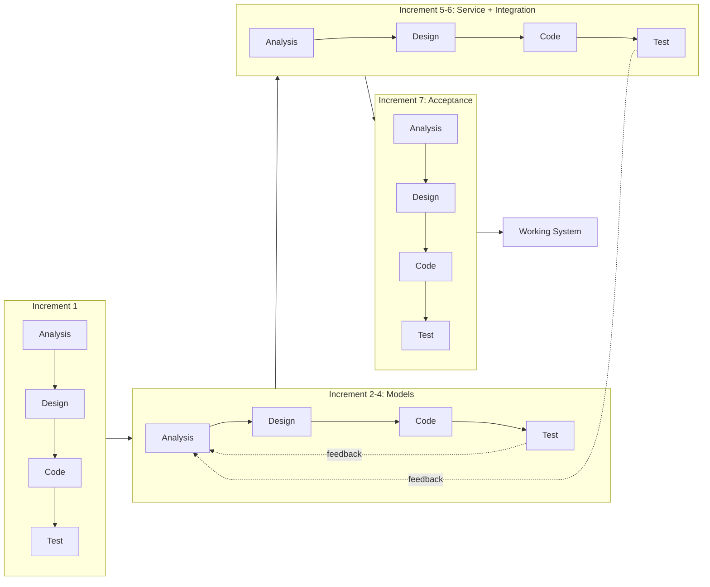

## 1.6 Report Organization

**Chapter 1: Introduction** presents the project background, the problem statement, the
objectives, the scope and limitations, and the development methodology adopted.

**Chapter 2: Background Study and Literature Review** reviews inventory management theory
relevant to perishable goods, examines existing commercial cafe and restaurant management
systems, surveys academic work on demand forecasting and stockout prediction, and identifies
the research gap this project addresses.

**Chapter 3: System Analysis and Design** presents the functional and non-functional
requirements, the feasibility analysis, the system models expressed in UML, the database
design, the algorithms employed, and the construction of the dataset.

**Chapter 4: Implementation and Testing** describes the tools used, the implementation of each
module, the testing performed at unit and acceptance level, and a detailed analysis of the
results including the criteria that were not met.

**Chapter 5: Conclusion and Future Work** summarises what was achieved, states plainly what
was not, and sets out the work required before the system could be relied upon commercially.

---
<div style="page-break-after: always;"></div>

# CHAPTER 2: BACKGROUND STUDY AND LITERATURE REVIEW

## 2.1 Background Study

### 2.1.1 Inventory Management in Food Service

Inventory management in food service differs from general retail in three respects that
together make it unusually difficult.

**Perishability.** A significant share of cafe stock has a shelf life measured in days. Classical
inventory models such as the Economic Order Quantity assume stock can be held indefinitely at a
constant carrying cost. For milk with a four-day life, this assumption fails outright: the
carrying cost becomes total loss at a fixed date. Ordering policy for perishables must
therefore balance stockout risk against spoilage risk, and the optimum is not simply "order
more".

**Derived demand.** A cafe does not sell ingredients; it sells prepared items. Demand for milk
is not observed directly but derives from demand for milk tea, cappuccino, latte, hot chocolate
and cold coffee, each consuming a different quantity. Forecasting ingredient requirement
therefore requires forecasting *item* demand and then transforming it through a recipe book —
a two-stage problem sometimes described as bill-of-materials explosion in manufacturing.

**Substitution and lost sales.** When a retail item is out of stock, the sale is often merely
delayed. In a cafe, a customer who cannot obtain their intended order will frequently either
choose a lower-margin substitute or leave. The lost sale is rarely recorded anywhere, so
stockout cost is systematically invisible in the accounts.

### 2.1.2 Classification of Inventory Control Policies

Inventory control policies are conventionally grouped as follows.

*Continuous review (s, Q)* policies place an order of fixed quantity Q whenever stock falls to
reorder point s. *Periodic review (R, S)* policies inspect stock every R days and order up to a
target level S. *Min-max* policies, of which the current CafeOS implementation is an instance,
order when stock falls below a minimum and top up to a maximum.

All of these are **static**: the parameters are fixed and do not adapt to changing demand rate,
demand variability, or known future events. A reorder point calculated for an average week is
wrong in every week that is not average — which, in a market with a strong festival calendar
and a pronounced monsoon, is most weeks.

The alternative is a **predictive** policy, in which the reorder decision is driven by a forecast
of future consumption rather than by a threshold on present stock. This is the approach taken
in this project.

### 2.1.3 The Existing CafeOS Platform

CafeOS is implemented as a Next.js web application backed by a PostgreSQL database hosted on
Supabase. Its inventory module maintains three principal tables: `cafe_ingredients` recording
each raw material with its unit, current stock, minimum stock level, and purchase price;
`cafe_recipes` linking a menu item to a set of ingredient requirements; and
`cafe_recipe_ingredients` holding the quantity and waste factor of each component.

The module supports adding and editing ingredients, defining recipes, calculating food cost and
gross margin per menu item, and displaying a low-stock alert list. The alert logic is a direct
comparison of `current_stock` against `min_stock_level`.

This project does not replace that module. It adds a predictive layer above it, consuming the
same tables and presenting its output on the same screen.

## 2.2 Literature Review

### 2.2.1 Existing Commercial Systems

**Petpooja**, widely deployed across South Asia including Nepal, offers restaurant billing,
kitchen display, and inventory management with recipe-based stock deduction and low-stock
alerts. Its inventory intelligence is threshold-driven; published documentation describes
consumption reporting and variance analysis but not forward demand prediction at the item
level.

**Square for Restaurants** provides point-of-sale, inventory tracking, and sales reporting,
including historical trend charts. Its stock alerts are again threshold-based. Square publishes
sales trend visualisations that assist a human in forecasting, but the ordering decision itself
remains manual.

**MarketMan** and **Craftable** are specialised restaurant inventory and procurement platforms
offering supplier integration, invoice reconciliation, theoretical-versus-actual usage
variance, and par-level management. Par levels are typically set manually or computed from
historical averages. These systems represent the current commercial state of the art in
restaurant inventory, and their sophistication lies principally in procurement workflow and
cost control rather than in statistical forecasting.

The common characteristic across these platforms is that **inventory intelligence is
retrospective**. They analyse what was consumed with considerable rigour, and alert when stock
is presently low, but they do not predict item-level demand and propagate it through the recipe
book to derive future ingredient requirements.

### 2.2.2 Demand Forecasting in Food Retail

Demand forecasting is a mature field, and the applicability of machine learning to it is
well established.

Classical time-series approaches — exponential smoothing and the ARIMA family — model a single
series through its own autocorrelation structure. They perform well on long, stable, regular
series. Their weakness in the present context is that they accommodate exogenous variables
awkwardly and require a separate model per series; a cafe with twenty-one menu items would
require twenty-one fitted models, each with too little data.

Tree-based ensemble methods have become the practical default for retail demand forecasting.
Random Forests, introduced by Breiman, construct many decision trees on bootstrap samples with
randomised feature subsets and average their predictions, which reduces the variance that makes
a single deep tree unreliable. Gradient boosting methods fit trees sequentially to the residuals
of their predecessors.

The decisive advantage of these methods for retail demand is that they accept heterogeneous
features naturally. Calendar effects, promotional flags, price, weather, and lagged sales can
all be presented as columns of a single table, and a single model can be fitted across all
items with the item identity itself as a feature. This allows items with sparse history to
borrow strength from the overall pattern — an important property for a cafe menu in which the
top item may sell a hundred times more than the least popular.

The prominence of gradient-boosted trees in retail forecasting competitions, notably the M5
competition on Walmart hierarchical sales data, reflects this practical strength. Recurrent and
transformer-based neural architectures have demonstrated superior accuracy on very large
retail datasets, but require training data volumes far beyond what a single independent cafe
generates.

### 2.2.3 Stockout Prediction

Stockout prediction has received less academic attention than demand forecasting, and is
usually treated as a downstream consequence of it: forecast demand, compare with stock, declare
a stockout when the former exceeds the latter.

This arithmetic approach has a recognised weakness. It propagates all the error of the demand
forecast into the stockout decision and, critically, it treats the forecast as certain. It has
no way to express that an ingredient with highly *variable* consumption is riskier than one
with the same *average* consumption but stable demand, even though both show identical days of
cover.

Treating stockout prediction as a **classification problem in its own right**, with the label
drawn from observed historical stockout events, avoids this. The classifier can learn directly
that volatility, supplier lead time, shelf life, and time since last delivery carry
information about stockout risk beyond what days-of-cover expresses. This is the formulation
adopted in this project, and Section 4.4.5 provides empirical support for it: consumption
volatility and time since last purchase rank among the model's most important features, and the
model substantially outperforms the days-of-cover rule.

### 2.2.4 Perishable Inventory Theory

The foundational treatment of ordering under uncertainty for perishable goods is the newsvendor
model, in which a single order is placed before demand is observed, unsold stock is lost, and
the optimal order quantity balances the cost of over-ordering against the cost of
under-ordering. The optimal quantity is the demand quantile determined by the ratio of these
two costs.

The practical implication for this project is that the correct order quantity is **not** the
expected demand. Where spoilage cost is low relative to lost margin, the optimum exceeds
expected demand; where spoilage cost is high, it falls below it. The rule layer implemented in
this project reflects this asymmetry in a simplified, deterministic form: it will top up an
ingredient classified `URGENT` even when the arithmetic does not demand it, while capping any
perishable order at the quantity consumable within its shelf life.

## 2.3 Research Gap

The review above identifies a consistent gap.

Commercial cafe and restaurant platforms — including CafeOS itself — maintain the recipe book
and the sales history required for predictive inventory control, but use them only
retrospectively, for costing and for threshold alerts.

The academic literature demonstrates that tree-based ensembles forecast retail demand
effectively, but published work concentrates on large chains with substantial data, and treats
stockout as an arithmetic consequence of the forecast rather than as a learned classification
task.

Neither body of work addresses the specific setting of an independent cafe in Nepal, where the
festival calendar produces demand swings of ±45%, the monsoon suppresses footfall for three
months, and perishable shelf lives of three to four days make over-ordering as costly as
under-ordering.

This project addresses that gap by combining three elements within a single working system:

1. Item-level demand forecasting that explicitly encodes Nepali weekday rhythm, festival
   effects, and monsoon seasonality;
2. Stockout risk treated as a supervised classification problem learned from observed stockout
   events, benchmarked against the arithmetic rule it replaces; and
3. A deterministic guardrail layer that prevents either model from producing an order that
   violates perishability or supplier constraints.

---
<div style="page-break-after: always;"></div>

# CHAPTER 3: SYSTEM ANALYSIS AND DESIGN

## 3.1 System Analysis

### 3.1.1 Requirement Analysis

#### i. Functional Requirements

**FR-1: Demand Forecasting**
- The system shall predict next-day unit sales for each active menu item.
- The prediction shall incorporate lagged sales, day of week, month, festival effect, monsoon
  status, price, and promotion status.
- The system shall return predictions for multiple items in a single request.

**FR-2: Stockout Risk Classification**
- The system shall classify every active ingredient as `SAFE`, `WATCH`, or `URGENT` over a
  seven-day horizon.
- Each classification shall carry a confidence value and a full probability distribution over
  the three classes.
- The system shall report days of cover alongside the classification.

**FR-3: Ingredient Requirement Calculation**
- The system shall convert forecast item demand into ingredient requirements using the recipe
  book.
- The calculation shall apply the waste factor recorded against each recipe component.
- Where no recipe exists for an ingredient, the system shall fall back to that ingredient's own
  recent consumption rate.

**FR-4: Reorder Plan Generation**
- The system shall produce a purchase list stating, per ingredient, the quantity to order, the
  number of supplier packs, the estimated cost, and the date by which the order must be placed.
- The order-by date shall account for supplier lead time and risk class.
- The plan shall be sortable by urgency.

**FR-5: Purchasing Guardrails**
- The system shall never recommend a perishable quantity exceeding what can be consumed within
  its shelf life, after pack-size rounding and after any supplier minimum order quantity.
- The system shall round order quantities up to whole supplier packs, subject to the above.
- Guardrails shall be deterministic and shall override model output.

**FR-6: Presentation**
- The reorder plan shall be displayed on the existing inventory screen.
- The horizon shall be user-selectable between three, seven, and fourteen days.
- Ingredients requiring no action shall be collapsed by default.

**FR-7: Graceful Degradation**
- If the prediction service is unreachable, the system shall fall back to the static coverage
  rule and display a clear notice that predictions are unavailable.
- Failure of the prediction service shall never prevent the inventory screen from rendering.

**FR-8: Data Quality Reporting**
- The system shall report how many days of sales history were available.
- Where history is insufficient, the interface shall state so rather than presenting a
  confident-looking but unsupported prediction.

**Table 3.1: Functional Requirements Summary**

| ID | Requirement | Priority | Verified By |
|---|---|---|---|
| FR-1 | Demand forecasting | High | MAT-01, MAT-02, MAT-03 |
| FR-2 | Stockout risk classification | High | MAT-04, MAT-05, MAT-06 |
| FR-3 | Ingredient requirement calculation | High | Unit test MUT-08 |
| FR-4 | Reorder plan generation | High | Unit test MUT-11 |
| FR-5 | Purchasing guardrails | Critical | MAT-08 |
| FR-6 | Presentation on inventory screen | Medium | Manual test |
| FR-7 | Graceful degradation | High | Manual test MT-01 |
| FR-8 | Data quality reporting | Medium | Manual test |

#### ii. Non-Functional Requirements

**Performance.** A reorder plan covering forty ingredients shall be produced within two seconds
under normal conditions. The prediction service shall time out after eight seconds, after which
the fallback path is taken.

**Reliability.** The web application shall remain fully functional when the prediction service
is unavailable. No single point of failure introduced by this project may take down the
existing inventory module.

**Security.** All prediction endpoints exposed to the browser shall require an authenticated
session. A cafe shall be able to obtain predictions only for its own ingredients, enforced
through the existing Row Level Security policies. The prediction service shall bind to the
loopback interface and shall not be exposed publicly.

**Usability.** The reorder plan shall be comprehensible to a cafe manager with no statistical
training. Risk shall be conveyed through colour and plain language rather than probability
values alone. Every recommendation shall carry a one-line explanation of why it was made.

**Maintainability.** Model training shall be reproducible from a fixed random seed. The
prediction service shall be independently deployable and testable.

**Portability.** The prediction service shall run on standard consumer hardware without a GPU.

### 3.1.2 Feasibility Analysis

**Technical Feasibility.** The project uses established, well-documented technologies. The
existing application is Next.js with TypeScript on Supabase PostgreSQL. The prediction service
uses Python with scikit-learn and FastAPI, all mature open-source libraries with extensive
documentation. Model training completes in under two minutes on a standard laptop with no
specialised hardware. The project is technically feasible.

**Operational Feasibility.** The predictive layer appears within a screen cafe staff already
use, requires no new login or workflow, and presents its output as a shopping list rather than
as statistics. The manager retains full decision authority; the system advises and does not
order automatically. Adoption risk is therefore low.

**Economic Feasibility.** All components are open-source and free of licensing cost. The
prediction service runs on the same machine as the web application in development. The dominant
cost is developer time. Against this, a single avoided stockout of a high-volume item, or a
single avoided spoilage of a bulk perishable purchase, recovers a meaningful fraction of the
cafe's daily margin. The project is economically feasible.

**Schedule Feasibility.** The work was scheduled across the increments listed in Section 1.5.
Because the project extends an existing, working application rather than building one from
scratch, the schedule risk concentrated in the modelling increments, where results cannot be
guaranteed in advance. This risk materialised once — the first dataset generator produced an
unusable class distribution — and was absorbed within the increment.

**Figure 3.2: Gantt Chart of the Project Schedule**

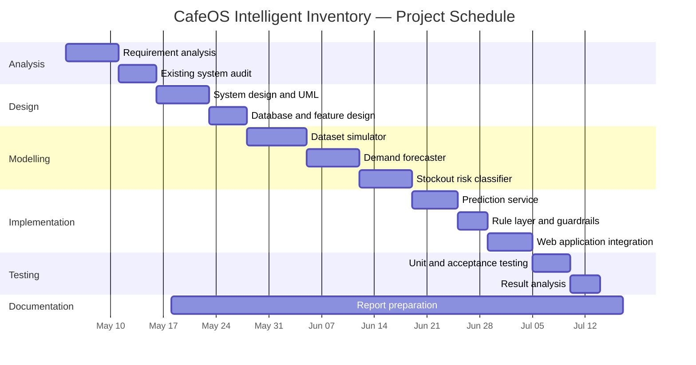

### 3.1.3 Use Case Analysis

**Figure 3.1: Use Case Diagram of the Intelligent Inventory Module**

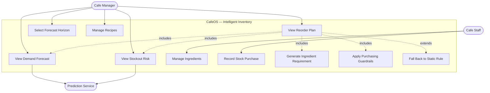

**Use Case: View Reorder Plan**

| Field | Description |
|---|---|
| **Actor** | Cafe Manager |
| **Precondition** | Manager is authenticated; the cafe has at least one active ingredient |
| **Main Flow** | 1. Manager opens the Saman Hisab inventory screen.<br>2. System reads active ingredients and the recipe book.<br>3. System reconstructs recent daily consumption from order history.<br>4. System requests a demand forecast and risk classification.<br>5. System converts forecast demand into ingredient requirement.<br>6. System applies purchasing guardrails.<br>7. System displays the ranked reorder plan. |
| **Alternate Flow A** | At step 4, the prediction service is unreachable. System applies the static coverage rule, marks the response as degraded, and displays a notice. |
| **Alternate Flow B** | At step 3, fewer than seven days of history exist. System proceeds but flags the data quality as insufficient. |
| **Postcondition** | Manager can see which ingredients to order, in what quantity, and by when |

## 3.2 System Design

### 3.2.1 Database Design

The predictive layer reads from the existing CafeOS schema and introduces no new tables. The
entities relevant to this project are shown below.

**Figure 3.3: Entity Relationship Diagram**

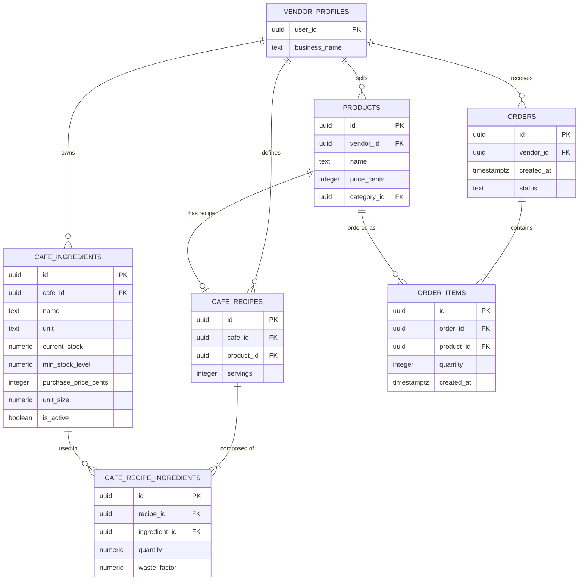

### 3.2.2 Class Design

**Figure 3.4: Class Diagram of the Prediction Subsystem**

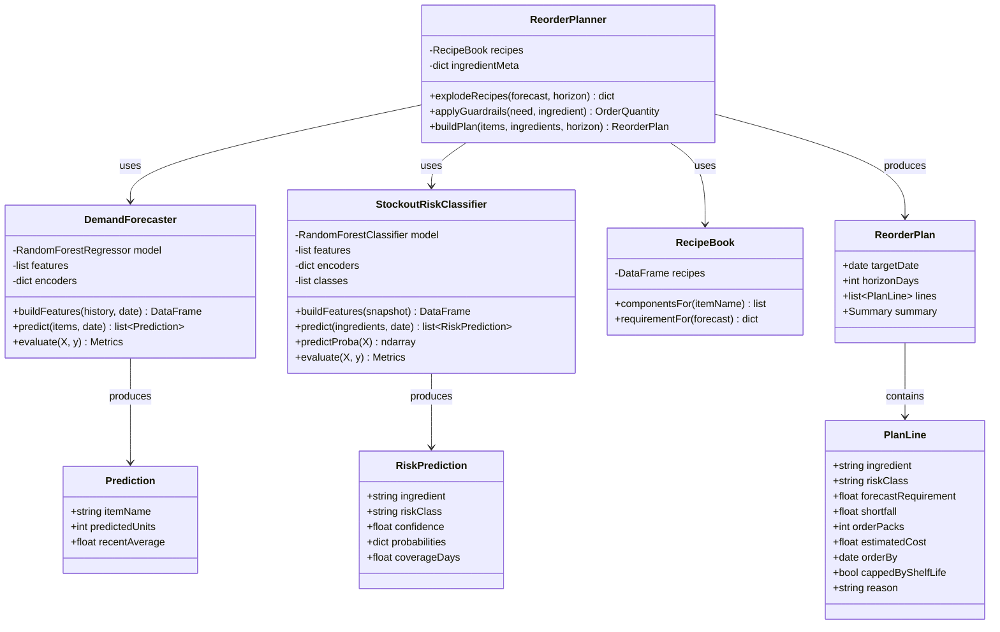

### 3.2.3 Dynamic Modelling

**Figure 3.5: Sequence Diagram — Generating a Reorder Plan**

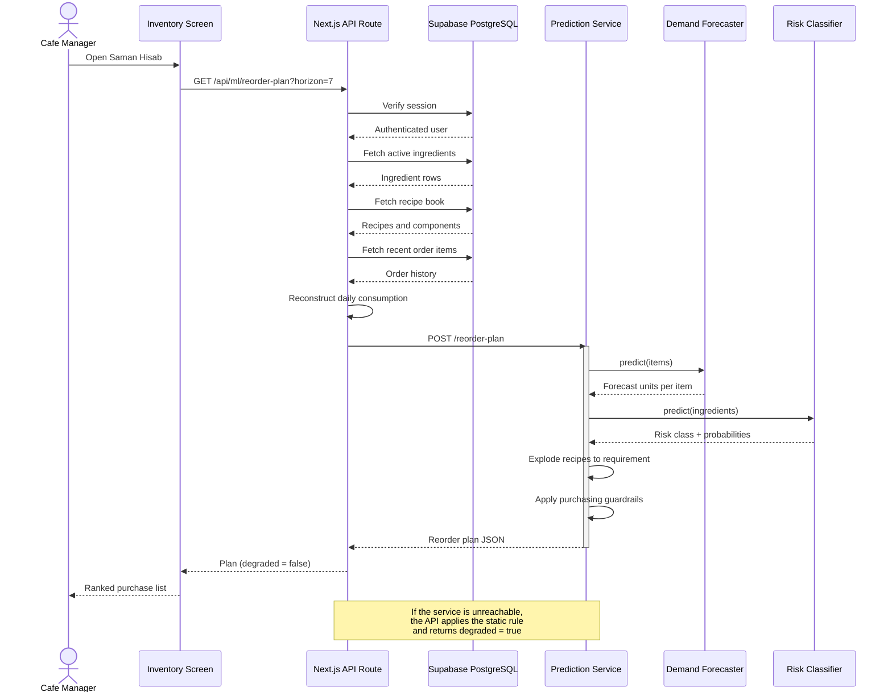

**Figure 3.6: Activity Diagram — Daily Inventory Decision Flow**

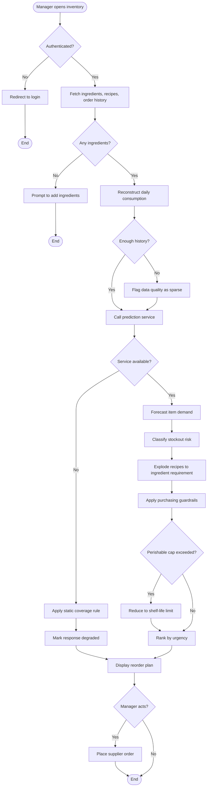

**Figure 3.7: State Diagram — Ingredient Risk Lifecycle**

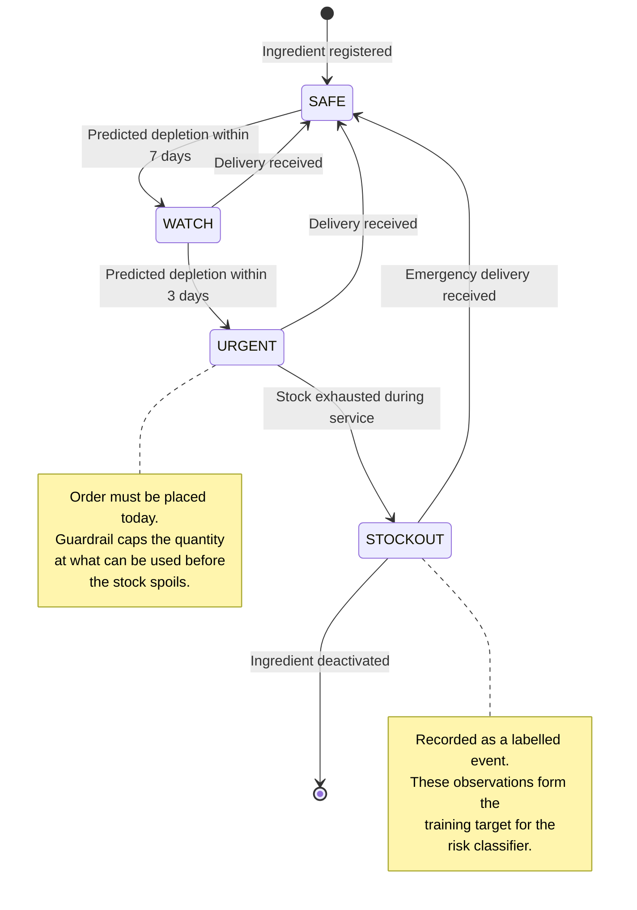

### 3.2.4 Architectural Design

**Figure 3.8: Component Diagram of CafeOS with the ML Service**

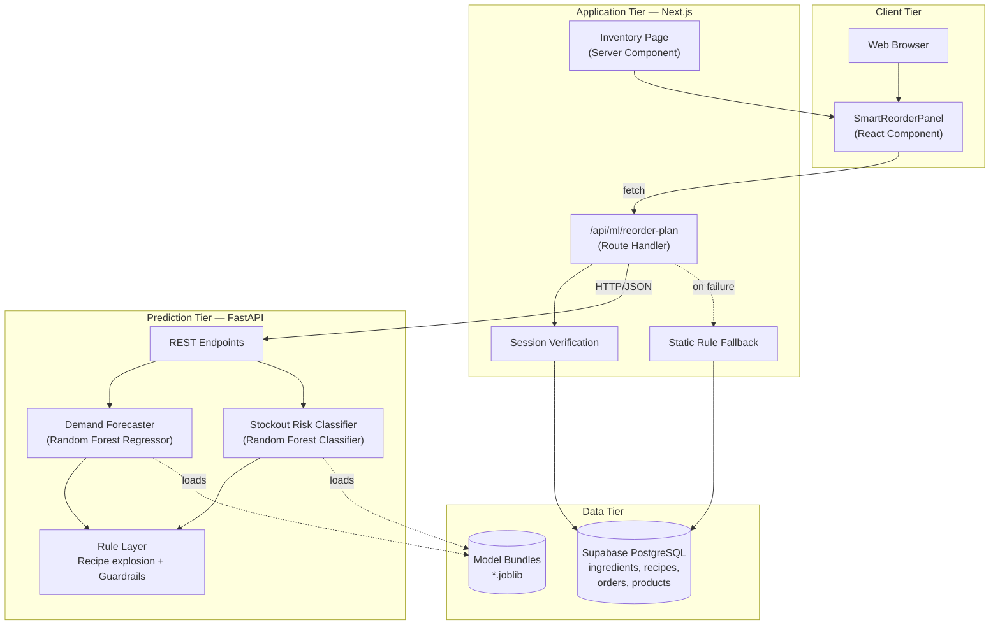

**Figure 3.9: Deployment Diagram**

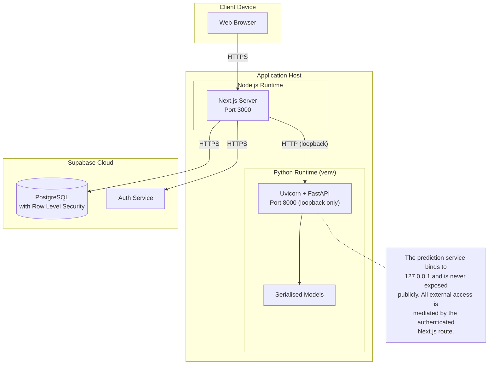

## 3.3 Algorithm Details

### 3.3.1 Algorithm 1: Random Forest Regressor — Demand Forecasting

A Random Forest is an ensemble of decision trees. Each tree is trained on a bootstrap sample of
the training data, and at each split only a random subset of features is considered. For
regression, the ensemble prediction is the mean of the individual tree predictions. Averaging
reduces the variance that makes a single deep decision tree unstable, while randomised feature
selection decorrelates the trees so that averaging is effective.

**Purpose in this project:** predict the number of units of a menu item that will be sold on the
following day.

**Input features:**

| Group | Features |
|---|---|
| Lagged sales | `lag_1`, `lag_7`, `lag_14` |
| Rolling statistics | `roll_mean_7`, `roll_mean_28`, `roll_std_7` |
| Weekday signature | `dow_ratio` (same weekday last week ÷ weekly mean) |
| Calendar | `day_of_week`, `month`, `day_of_month`, `is_saturday` |
| Nepali context | `festival_effect`, `is_monsoon`, `thermal_index` |
| Commercial | `price_rs`, `promo_active` |
| Item identity | `item_name`, `category` |
| Maturity | `days_since_open` |

**Output:** predicted units sold (continuous, floored at zero and rounded for display).

**Steps:**

1. Assemble the daily sales history for every menu item.
2. For each item, compute lagged and rolling features using only days strictly earlier than the
   day being predicted.
3. Encode categorical features (`item_name`, `category`, `festival_effect`) as integers.
4. Split the data chronologically into training, validation, and test windows.
5. Train candidate regressors on the training window.
6. Score each candidate on the validation window; select the lowest Mean Absolute Error.
7. Score the selected model once on the untouched test window.
8. Serialise the model together with its feature list and encoders.

**Pseudocode:**

```
ALGORITHM DemandForecast
INPUT   sales_history H, target_date d, item i
OUTPUT  predicted units u

BEGIN
    S  <- filter(H, item = i AND date < d)
    IF |S| < 28 THEN
        S <- left_pad(S, mean(S))       // new items borrow their own mean
    END IF

    f.lag_1       <- S[d - 1]
    f.lag_7       <- S[d - 7]
    f.lag_14      <- S[d - 14]
    f.roll_mean_7 <- mean(S[d-7 .. d-1])
    f.roll_mean_28<- mean(S[d-28 .. d-1])
    f.roll_std_7  <- stddev(S[d-7 .. d-1])
    f.dow_ratio   <- f.lag_7 / f.roll_mean_7

    f.day_of_week <- weekday(d)
    f.is_saturday <- (weekday(d) = SATURDAY)
    f.month       <- month(d)
    f.festival    <- festival_effect(d)     // spike | exodus | pre_festival | holiday | none
    f.is_monsoon  <- month(d) IN {6,7,8}
    f.thermal     <- cos(2*PI*(dayofyear(d) - 15) / 365.25)

    FOR EACH tree t IN forest DO
        p[t] <- t.predict(f)
    END FOR

    u <- max(0, mean(p))
    RETURN u
END
```

### 3.3.2 Algorithm 2: Random Forest Classifier — Stockout Risk

The same ensemble principle is applied to classification, with each tree casting a vote and the
class probability given by the proportion of trees voting for it. Class weights are balanced so
that the minority `WATCH` and `URGENT` classes are not overwhelmed by the majority `SAFE` class.

**Purpose in this project:** classify each ingredient's risk of running out within seven days.

**Target definition.** This is the key design decision of the project, and it distinguishes the
approach from the arithmetic method described in Section 2.2.3. The label is **not** derived
from a threshold on days of cover. It is derived from **observed future outcomes** in the
history: for each daily snapshot of an ingredient, the number of days until that ingredient
actually ran out during service is counted forward, and the class assigned accordingly.

| Days until the ingredient actually ran out | Class |
|---|---|
| 3 or fewer | `URGENT` |
| 4 to 7 | `WATCH` |
| More than 7 (or never) | `SAFE` |

Because the label records what really happened rather than what a rule predicted, the model is
free to discover that factors beyond days of cover — consumption volatility, supplier lead
time, shelf life, time since last delivery — carry genuine information. Section 4.4.5 confirms
that it does.

**Input features:**

| Group | Features |
|---|---|
| Stock position | `opening_stock`, `coverage_days`, `incoming_qty_7d` |
| Consumption rate | `consumption_mean_7d`, `consumption_mean_14d`, `consumption_mean_28d` |
| Consumption stability | `consumption_std_7d`, `volatility_ratio`, `consumption_trend` |
| Supply chain | `supplier_lead_time_days`, `days_since_purchase`, `pack_price_rs` |
| Product nature | `shelf_life_days`, `unit`, `ingredient` |
| Calendar | `day_of_week`, `month`, `festival_effect`, `is_monsoon` |

**Output:** class in {`SAFE`, `WATCH`, `URGENT`} with a probability distribution.

**Steps:**

1. Replay the sales history through the recipe book to derive daily ingredient consumption.
2. Simulate the stock ledger with FIFO batch expiry, supplier lead times, and delivery delays,
   recording every day on which an ingredient was exhausted during service.
3. For each daily snapshot, compute the stock, consumption, supply-chain, and calendar features
   using information available on that day only.
4. Assign the label by counting forward to the next observed stockout.
5. Split chronologically; train candidates; select on validation macro F1.
6. Score the selected model once on the test window, and score the static coverage rule on the
   same window for comparison.

**Pseudocode:**

```
ALGORITHM StockoutRisk
INPUT   ingredient g, snapshot date d, consumption history C, stock position P
OUTPUT  risk class r, confidence c

BEGIN
    f.opening_stock    <- P.on_hand(g, d)
    f.mean_7           <- mean(C[g][d-7 .. d-1])
    f.mean_28          <- mean(C[g][d-28 .. d-1])
    f.std_7            <- stddev(C[g][d-7 .. d-1])
    f.volatility_ratio <- f.std_7 / f.mean_7
    f.trend            <- f.mean_7 / f.mean_28
    f.coverage_days    <- f.opening_stock / f.mean_7
    f.lead_time        <- g.supplier_lead_time
    f.shelf_life       <- g.shelf_life
    f.days_since_buy   <- d - P.last_delivery(g)
    f.incoming_7d      <- sum(P.pending(g, d+1 .. d+7))
    f.festival         <- festival_effect(d)

    votes <- empty map
    FOR EACH tree t IN forest DO
        votes[t.predict(f)] <- votes[t.predict(f)] + 1
    END FOR

    r <- argmax(votes)
    c <- votes[r] / |forest|
    RETURN (r, c)
END
```

### 3.3.3 Algorithm 3: Deterministic Rule Layer

Machine learning output is advisory. The rule layer converts it into a purchase decision and
enforces constraints that must hold regardless of what either model predicts.

**Rationale.** A model may be wrong about quantity; it must never be permitted to recommend
buying a week's supply of a three-day perishable. Encoding these constraints as learned
behaviour would make them probabilistic. Encoding them as deterministic rules makes them
guarantees.

**Rules implemented:**

| Rule | Statement |
|---|---|
| R1 — Recipe explosion | Ingredient requirement = Σ (forecast units × quantity per serving × waste factor) over all menu items using that ingredient |
| R2 — Fallback requirement | Where no recipe exists, requirement = mean recent daily consumption × horizon |
| R3 — Shortfall | Shortfall = requirement − current stock − incoming deliveries |
| R4 — Urgent top-up | If class is `URGENT`, order at least half the horizon requirement even when the shortfall calculation says otherwise |
| R5 — Pack rounding | Round the order up to whole supplier packs |
| R6 — Minimum order quantity | Respect the supplier's minimum order quantity |
| R7 — Shelf-life cap | **After** R5 and R6, cap the quantity at what can be consumed within the shelf life. One pack is always permitted, since a part pack cannot be bought. R7 overrides R4, R5 and R6. |
| R8 — Order-by date | `URGENT` → order today; `WATCH` → order within (3 − lead time) days; `SAFE` → within (7 − lead time) days |

Rule R7 is the most important, and its ordering relative to R5 and R6 was corrected during
testing. The initial implementation applied the shelf-life cap *before* pack rounding, with the
result that rounding up to the nearest whole pack pushed the final quantity marginally past the
cap. Acceptance test MAT-08 detected this (81 litres of milk ordered against a 3-day shelf life,
equal to 3.01 days of supply). The rule was reordered so that the cap is applied after rounding,
and the test now passes at 2.98 days of supply. This is documented in Section 4.3.

**Figure 3.10: Machine Learning Pipeline**

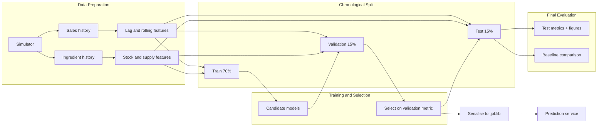

## 3.4 Dataset Construction

### 3.4.1 The Data Problem and Its Disclosure

Supervised learning requires labelled historical data. The live CafeOS database contains
approximately **seventeen genuine point-of-sale orders**; the remaining fifteen hundred rows in
the orders table were inserted directly during development to exercise the user interface and
do not represent real trading. There is no genuine stock movement history at all, because the
inventory module records current levels rather than a movement ledger.

Training a model on seventeen orders is not possible. Two options were available: postpone the
project until real trading data accumulated, or construct a simulator that generates data with
realistic structure and be explicit that the resulting figures measure recovery of simulated
structure rather than real-world accuracy.

The second option was taken, and **the disclosure is repeated wherever results are presented.**
The evaluation in Chapter 4 answers the question *"can these models learn the patterns that
exist in cafe demand?"* It does not answer *"how accurate will these models be at a real cafe?"*
Answering the second question requires real trading data and is the first item of future work
in Chapter 5.

### 3.4.2 The Simulator

The simulator constructs eighteen months of operating history, from 1 February 2025 to
31 July 2026, for a cafe with 21 menu items and 28 ingredients. It is driven by a fixed random
seed so that every figure in this report is reproducible.

**Table 3.2: Simulated Effects in the Dataset Generator**

| Effect | Modelling | Justification |
|---|---|---|
| Weekday rhythm | Saturday ×1.32, Friday ×1.14, Sunday ×0.90, Monday ×0.92 | Saturday is Nepal's weekly holiday; Sunday is a working day |
| Festival spike | Holi, Nepali New Year, Teej, Christmas, Valentine's ×1.45 | Celebratory footfall |
| Festival exodus | Dashain and Tihar ×0.58 | Kathmandu residents travel to ancestral homes |
| Pre-festival rush | Four days before an exodus festival ×1.28 | Shopping and social activity before departure |
| Monsoon | June ×0.88, July ×0.82, August ×0.86 | Rain suppresses walk-in footfall |
| Thermal elasticity | Hot items ×(1 + 0.42·cos θ); cold items inverted | Hot drinks rise in winter, cold in summer |
| Growth | Linear +38% across the window | Organic growth of the customer base |
| Promotions | Nine campaigns, 7–21 days, ×1.22 on affected items | Happy-hour and discount activity |
| Daily shock | Gaussian, σ = 0.085 | Weather, local events, road closures |
| Item noise | Poisson around the resulting mean | Count data are Poisson-distributed |

Ingredient consumption is derived by replaying each day's item sales through the recipe book
with a random kitchen waste factor of 4–9%. The stock ledger is then simulated with:

- **FIFO batch expiry.** Stock is held as dated batches. Perishables are discarded when they
  pass their shelf life. Without this, simulated milk accumulated indefinitely and the cafe
  never ran out of anything.
- **Unreliable suppliers.** Approximately one delivery in eight arrives one to three days late.
- **Imperfect review cadence.** The simulated manager inspects stock every third day against a
  flat four-day rule of thumb — deliberately modelling the heuristic CafeOS ships today.

The first version of the simulator omitted spoilage and used a more diligent ordering policy.
It produced a class distribution of 98.4% `SAFE`, 0.9% `WATCH`, 0.7% `URGENT` — a target with
nothing to learn. Adding the three friction sources above produced the distribution actually
used: **54.46% `SAFE`, 18.43% `WATCH`, 27.11% `URGENT`.**

### 3.4.3 Resulting Datasets

| Dataset | Rows | Shape |
|---|---|---|
| `sales_history.csv` | 11,466 | 546 days × 21 menu items |
| `ingredient_history.csv` | 14,448 | 516 days × 28 ingredients (30-day warm-up excluded) |
| `menu_items.csv` | 21 | Menu definition |
| `ingredients.csv` | 28 | Ingredient definition with shelf life and lead time |
| `recipes.csv` | 67 | Item-to-ingredient components |

**Table 3.3: Feature Set — Demand Forecaster (19 features)**

| Feature | Type | Description |
|---|---|---|
| `lag_1`, `lag_7`, `lag_14` | Numeric | Units sold 1, 7, 14 days ago |
| `roll_mean_7`, `roll_mean_28` | Numeric | Mean units over the trailing 7 and 28 days |
| `roll_std_7` | Numeric | Standard deviation over the trailing 7 days |
| `dow_ratio` | Numeric | `lag_7` ÷ `roll_mean_7` |
| `price_rs` | Numeric | Menu price |
| `thermal_index` | Numeric | Seasonal temperature proxy, −1 to +1 |
| `day_of_week`, `month`, `day_of_month` | Numeric | Calendar position |
| `is_saturday`, `is_monsoon`, `promo_active` | Binary | Indicator flags |
| `days_since_open` | Numeric | Days since the start of the history |
| `item_name`, `category`, `festival_effect` | Encoded | Label-encoded categoricals |

**Table 3.4: Feature Set — Stockout Risk Classifier (19 features)**

| Feature | Type | Description |
|---|---|---|
| `opening_stock` | Numeric | Stock on hand at the start of the day |
| `coverage_days` | Numeric | `opening_stock` ÷ 7-day mean consumption |
| `consumption_mean_7d`, `_14d`, `_28d` | Numeric | Mean daily consumption over each window |
| `consumption_std_7d` | Numeric | Consumption standard deviation, 7 days |
| `volatility_ratio` | Numeric | `std_7d` ÷ `mean_7d` |
| `consumption_trend` | Numeric | `mean_7d` ÷ `mean_28d` |
| `days_since_purchase` | Numeric | Days since the last delivery |
| `incoming_qty_7d` | Numeric | Quantity already ordered and arriving within 7 days |
| `shelf_life_days` | Numeric | Product shelf life |
| `supplier_lead_time_days` | Numeric | Supplier lead time |
| `pack_price_rs` | Numeric | Cost per supplier pack |
| `day_of_week`, `month`, `is_monsoon` | Numeric / Binary | Calendar position |
| `ingredient`, `unit`, `festival_effect` | Encoded | Label-encoded categoricals |

### 3.4.4 Preventing Data Leakage

Two precautions were taken against leakage, since either would inflate every figure in
Chapter 4.

**Chronological splitting.** The data is split by date, not at random. The earliest 70% of days
train, the next 15% validate, and the final 15% test. A random split would place days from
after the test period into the training set, allowing the model to learn seasonal patterns it
would not have access to in reality. Acceptance test MAT-09 verifies that the training window
ends before the test window begins.

**Causal feature construction.** Every lag and rolling feature is computed using days strictly
earlier than the day being predicted. For the risk classifier, each daily snapshot is taken
*before* that day's service is simulated, so no feature can contain information about the
outcome being labelled.

---
<div style="page-break-after: always;"></div>

# CHAPTER 4: IMPLEMENTATION AND TESTING

## 4.1 Implementation

### 4.1.1 Tools Used

**Table 4.1: Tools and Technologies Used**

| Category | Tool | Purpose |
|---|---|---|
| **CASE tools** | Mermaid / draw.io | UML and ER diagrams |
| | Git | Version control |
| | Visual Studio Code | Source code editor |
| **Existing application** | Next.js 16 | React framework, server components, route handlers |
| | TypeScript 5 | Type-safe application code |
| | React 19 | User interface |
| | Tailwind CSS 4 | Styling |
| **Prediction service** | Python 3.12 | Machine learning implementation |
| | scikit-learn 1.6.1 | Random Forest models, metrics, preprocessing |
| | pandas 2.2.3 | Data manipulation |
| | NumPy 2.2.6 | Numerical computation |
| | FastAPI 0.115.9 | REST API framework |
| | Uvicorn 0.34.0 | ASGI server |
| | Pydantic 2.11.7 | Request and response validation |
| | joblib 1.4.2 | Model serialisation |
| | Matplotlib 3.10.1 | Evaluation figures |
| **Database** | Supabase (PostgreSQL) | Data storage, authentication, Row Level Security |
| **Testing** | Custom acceptance suite | Pre-declared criteria verification |
| | `tsc --noEmit` | TypeScript type checking |

### 4.1.2 Implementation Details of Modules

#### Module 1: Dataset Simulator (`generate_dataset.py`)

Implements the simulation described in Section 3.4. Principal procedures:

- `festival_context(date)` — returns the festival name, effect category, and demand multiplier
  for a given date, including the pre-festival shopping window.
- `thermal_index(date)` — returns a value in [−1, +1] representing seasonal temperature,
  computed from the day of year with the minimum at mid-January.
- `build_sales_history()` — generates the daily unit sales for every menu item by composing the
  weekday, festival, monsoon, thermal, growth, promotion, and shock multipliers, then drawing
  from a Poisson distribution.
- `build_ingredient_history()` — replays sales through the recipe book, simulates the stock
  ledger with FIFO batch expiry and unreliable deliveries, records stockout events, and assigns
  the risk label by counting forward to the next observed stockout.

#### Module 2: Model Training (`train_models.py`)

- `chronological_split(df)` — performs the 70/15/15 split on the date axis.
- `build_demand_features(sales)` — constructs lag and rolling features per item.
- `train_demand_model()` — trains and compares the demand regressor candidates, selects on
  validation MAE, scores once on the test window, generates figures, and serialises the bundle.
- `train_risk_model()` — the equivalent for the risk classifier, selecting on validation macro
  F1 and additionally scoring the static rule baseline on the same test window.
- `rule_baseline(df)` — implements the static coverage threshold for comparison.

Each serialised bundle contains the fitted model, the ordered feature list, the label encoders,
the selected model name, and the recorded metrics, so that the service can reconstruct feature
vectors identically to training.

#### Module 3: Prediction Service (`app/main.py`)

A FastAPI application exposing five endpoints.

**Table 4.2: REST API Endpoints of the ML Service**

| Method | Path | Purpose |
|---|---|---|
| GET | `/health` | Liveness probe; returns the loaded model names |
| GET | `/metrics` | Returns the evaluation figures reported in this chapter |
| POST | `/predict/demand` | Model 1 — next-day units for one or more menu items |
| POST | `/predict/stockout` | Model 2 — risk class per ingredient |
| POST | `/reorder-plan` | Combined pipeline producing the purchase list |

Design decisions of note:

- **Unseen category handling.** `safe_encode()` maps any category value not present during
  training onto class zero rather than raising. A cafe can add a menu item at any time; the
  service must degrade rather than fail.
- **Short history padding.** `_pad()` left-pads a history shorter than 28 days with its own
  mean, so newly added items still receive a prediction.
- **Loopback binding.** The service listens on 127.0.0.1 only and is never exposed publicly.
  All browser access is mediated by the authenticated Next.js route.

#### Module 4: Rule Layer (`reorder_plan` in `app/main.py`)

Implements rules R1–R8 from Section 3.3.3. It calls both models, explodes the recipe book,
computes shortfalls, applies the guardrails in the correct order, assigns order-by dates, and
ranks the output by urgency. The response flags `capped_by_shelf_life` where rule R7 reduced
the quantity, and the reason string explains this to the user.

#### Module 5: Web Application Integration (`/api/ml/reorder-plan/route.ts`)

A Next.js route handler that:

1. Verifies the Supabase session and resolves the cafe identity.
2. Loads active ingredients and the recipe book.
3. Reconstructs recent daily consumption by joining order items to recipe components. Because a
   development database may hold no orders in the last 28 calendar days, the route takes the
   most recent 28 days that contain data and reports the coverage found rather than silently
   returning zeros.
4. Calls the prediction service with an eight-second timeout.
5. **On any failure, falls back to the static coverage rule** and returns `degraded: true`.

The fallback is the significant engineering decision in this module. An inventory screen that
renders nothing because a Python process has stopped is worse for the cafe than one showing a
weaker prediction with an honest notice.

#### Module 6: User Interface (`SmartReorderPanel.tsx`)

A React client component rendered above the existing ingredient list. It presents a summary
strip (urgent count, watch count, items to order, estimated cost), a ranked list of
recommendations with plain-language reasons, a horizon selector, and banners for degraded mode
and insufficient history. Ingredients requiring no action are collapsed by default.

Risk is communicated through colour and words — "Urgent", "Watch", "Safe" — rather than through
probability values, in line with the usability requirement that a manager without statistical
training can act on the output.

## 4.2 Testing

Testing concentrated on the machine learning components and the rule layer, which are the
contribution of this project. The pre-existing point-of-sale, kitchen, and authentication
features of CafeOS were not re-tested.

### 4.2.1 Unit Testing of Model Components

Sixteen unit tests were implemented in `test_units.py` and are reproducible by running that
script. The table below is the script's actual output, not a summary of it.

**Table 4.3: Unit Test Cases of Model Components**

| Test ID | Component | Test Input | Expected Result | Actual Result | Status |
|---|---|---|---|---|---|
| MUT-01 | `festival_context` | 2025-10-01 (Dashain) | effect `exodus`, mult 0.58 | effect `exodus`, mult 0.58 | Pass |
| MUT-02 | `festival_context` | 2025-09-19 (3 days pre-Dashain) | effect `pre_festival`, mult 1.28 | effect `pre_festival`, mult 1.28 | Pass |
| MUT-03 | `festival_context` | 2026-03-03 (Holi) | effect `spike`, mult 1.45 | effect `spike`, mult 1.45 | Pass |
| MUT-04 | `thermal_index` | 15 January | approx +1.0 | 1.000 | Pass |
| MUT-05 | `thermal_index` | 16 July | approx −1.0 | −1.000 | Pass |
| MUT-06 | FIFO batch expiry | 1 expired batch (10), 1 fresh (5) | expired discarded, 5 retained | wasted 10.0, on hand 5.0 | Pass |
| MUT-07 | Stockout detection | demand 50, stock 30 | stockout flagged, 30 consumed | flag `True`, consumed 30.0 | Pass |
| MUT-08 | Recipe explosion | 155 milk teas × 0.15 L | 23.25 L raw, ≈24.6 L with waste | 23.25 L raw, 24.64 L with waste | Pass |
| MUT-09 | `safe_encode` | unseen ingredient name | returns 0, no exception | returned 0 | Pass |
| MUT-10 | `_pad` | 10-day history, 28 required | padded to length 28 | length 28, mean 5.0 | Pass |
| MUT-11 | Risk prediction (stable, high cover) | Sugar, ~11 days cover | class `SAFE` | `SAFE`, confidence 0.8115 | Pass |
| MUT-12 | Risk prediction (perishable, low cover) | Buff Mince, ~0.25 days cover | class `URGENT` | `URGENT`, confidence 0.7709 | Pass |
| MUT-13 | Probability distribution | risk prediction output | 3 classes summing to 1.0 | 3 classes, sum 1.0000 | Pass |
| MUT-14 | Model bundle loading | both `.joblib` bundles | models + feature lists load | RF Regressor (19 features);<br>RF Classifier (19 features) | Pass |
| MUT-15 | Health endpoint | GET `/health` | status ok with model names | ok: both model names | Pass |
| MUT-16 | Causal feature construction | `lag_7` alignment check | `lag_7` at row *i* equals units at row *i−7* | aligned `True` | Pass |

**Passed: 16 / 16**

MUT-16 deserves particular note. It verifies the leakage precaution described in Section 3.4.4
by directly asserting that the lag feature at any row equals the observed value seven rows
earlier. A misaligned shift would silently give the model access to the value it is meant to
predict, and would inflate every result in this chapter while producing no visible error.

The demand and risk prediction endpoints were additionally exercised end-to-end with
hand-constructed payloads representing a Saturday in monsoon season. The service returned
155 units for milk tea against a recent seven-day average of 168.7 — a reduction consistent
with the monsoon suppression the simulator encodes — and classified milk (0.39 days of cover)
and buffalo mince (0.25 days) as `URGENT` while classifying sugar (10.95 days) as `SAFE`.

### 4.2.2 Validation-Based Model Selection

Candidate models were compared on the validation window only. The test window was scored once,
with the already-selected model.

**Table 4.4: Validation-Based Model Selection — Demand Forecaster**

| Candidate | Validation MAE | Validation R² | Selected |
|---|---|---|---|
| **Random Forest Regressor** | **8.489** | **0.9029** | **Yes** |
| Ridge Regression | 9.377 | 0.8885 | No |
| Baseline: same weekday last week | 10.742 | 0.8457 | — |

**Table 4.5: Validation-Based Model Selection — Risk Classifier**

| Candidate | Validation Accuracy | Validation Macro F1 | Selected |
|---|---|---|---|
| Gradient Boosting Classifier | 81.59% | 0.7872 | No |
| **Random Forest Classifier** | **81.22%** | **0.7900** | **Yes** |
| Decision Tree Classifier | 80.47% | 0.7775 | No |
| Baseline: static coverage rule | 48.52% | 0.4636 | — |
| Baseline: majority class | 53.11% | 0.2312 | — |

The Random Forest Classifier was selected over Gradient Boosting despite marginally lower
accuracy, because selection was made on **macro F1**, which weights the minority `WATCH` and
`URGENT` classes equally with the majority `SAFE` class. Accuracy alone would favour a model
that performs well on `SAFE` — which is precisely the class whose correct prediction has the
least operational value. Failing to warn about an ingredient that is about to run out costs the
cafe a sale; correctly confirming that sugar is fine costs nothing to get wrong.

## 4.3 Acceptance Testing

Nine acceptance criteria were declared **before** the test window was scored, and are reported
below exactly as measured. Two were not met. They have not been adjusted to match the results.

**Table 4.6: Model Acceptance Test Results**

| Test ID | Acceptance Criterion | Required | Actual | Status |
|---|---|---|---|---|
| MAT-01 | Demand forecast R² | ≥ 0.85 | 0.8955 | **Pass** |
| MAT-02 | Demand forecast MAE | ≤ 12 units | 8.13 units | **Pass** |
| MAT-03 | Improvement over lag-7 baseline | ≥ 10% | 16.4% | **Pass** |
| MAT-04 | Risk classifier accuracy | ≥ 80% | 77.79% | **Fail** |
| MAT-05 | Risk classifier macro F1 | ≥ 0.75 | 0.7497 | **Fail** |
| MAT-06 | URGENT-class recall (safety-critical) | ≥ 0.75 | 0.8221 | **Pass** |
| MAT-07 | Beats the static coverage rule on macro F1 | > baseline | 0.7497 vs 0.4727 | **Pass** |
| MAT-08 | Perishable order never exceeds shelf life | ≤ 3 days of supply | 2.98 days | **Pass** |
| MAT-09 | Chronological split — no future data in training | train < test | train ends 2026-02-17,<br>test starts 2026-05-11 | **Pass** |

**Passed: 7    Failed: 2    Acceptance pass rate: 77.78%**

### 4.3.1 A Defect Found by Acceptance Testing

MAT-08 initially **failed**. The reorder planner recommended 81 litres of milk against a
three-day shelf life, equal to 3.01 days of supply — a marginal but genuine breach of the
guardrail that rule R7 exists to guarantee.

The cause was rule ordering. The shelf-life cap was applied to the target quantity *before* the
quantity was rounded up to whole supplier packs, so the rounding step pushed the final figure
past the cap. Since R7 is a safety guarantee rather than a preference, it must be the last rule
applied.

The implementation was corrected so that the cap is enforced after pack rounding and after the
supplier minimum order quantity, with one pack always permitted because a part pack cannot be
purchased. The test now passes at 2.98 days of supply.

This is recorded here because it illustrates the value of expressing guardrails as executable
tests rather than as prose. The breach was 0.01 days — invisible to inspection, and certain to
have been missed by a manual review of the code.

### 4.3.2 Manual Test: Graceful Degradation

Requirement FR-7 concerns behaviour spanning the browser, the Next.js route handler, and the
authenticated Supabase session. It cannot be exercised by the automated suite, which runs
against the prediction service alone. It is therefore specified as a manual test procedure.

**MT-01 — Graceful degradation when the prediction service is unavailable**

| Field | Description |
|---|---|
| **Precondition** | Both the Next.js application and the prediction service are running; the manager is logged in |
| **Steps** | 1. Open the Saman Hisab inventory screen and confirm the reorder plan renders normally.<br>2. Stop the prediction service (close its terminal window).<br>3. Reload the inventory screen. |
| **Expected result** | The screen renders in full. An amber banner reads "Prediction service offline — showing the basic stock rule instead." The plan is populated using the static coverage rule. No error page and no blank screen appears. The response carries `degraded: true`. |
| **Verifies** | FR-7 |

The fallback path is implemented in the route handler's `catch` block, which applies
`staticRuleFallback()` on any fetch failure or non-200 response, including the eight-second
timeout. The TypeScript for both the route and the panel compiles without error.

## 4.4 Result Analysis

> **Data disclosure.** Every figure in this section is computed on synthetic data produced by
> the simulator described in Section 3.4. These results demonstrate that the models recover the
> structure present in the simulation. They are **not** evidence of real-world forecasting
> accuracy at a working cafe.

### 4.4.1 Demand Forecaster — Test Set Results

**Table 4.7: Demand Forecaster — Test Set Evaluation**

| Metric | Value | Acceptance Target | Status |
|---|---|---|---|
| Mean Absolute Error | 8.131 units | ≤ 12 units | Pass |
| Root Mean Squared Error | 10.924 units | Not mandatory | — |
| R² (coefficient of determination) | 0.8955 | ≥ 0.85 | Pass |
| Baseline MAE (same weekday last week) | 9.726 units | — | — |
| Improvement over baseline | 16.4% | ≥ 10% | Pass |

The model explains 89.55% of the variance in next-day unit sales on the held-out test window.
The mean absolute error of 8.13 units should be read against the scale of the data: the busiest
item averages 158.8 units per day, so the typical error on that item is approximately 5% of
volume. For low-volume items selling around 12 units per day, the same absolute error is
proportionally much larger — a limitation discussed in Section 4.4.3.

The 16.4% improvement over the seasonal-naive baseline is the more meaningful figure. Predicting
"tomorrow will be like the same weekday last week" is what an experienced manager does
implicitly, and it is a strong baseline precisely because cafe demand is weekly-periodic. The
model's advantage comes from the effects that break the weekly pattern: festivals, the monsoon,
promotions, and trend.

**Figure 4.1: Demand Forecaster — Actual vs Predicted**
`reports/figures/fig_demand_actual_vs_predicted.png`

Points cluster along the diagonal across the range. Dispersion widens at higher volumes, which
is expected for count data where variance scales with the mean.

**Figure 4.2: Demand Forecaster — Residual Plot**
`reports/figures/fig_demand_residuals.png`

Residuals are centred on zero with no systematic directional bias, indicating the model is not
consistently over- or under-forecasting. The spread widens as predicted volume increases —
heteroscedasticity, again expected for Poisson-distributed counts.

**Figure 4.3: Demand Forecaster — Forecast Timeline**
`reports/figures/fig_demand_timeline.png`

Actual and predicted series for the highest-volume item track closely across the test window,
including the weekly Saturday peaks.

### 4.4.2 Demand Forecaster — Feature Importance

**Figure 4.4: Demand Forecaster — Feature Importance**
`reports/figures/fig_demand_importance.png`

| Rank | Feature | Importance |
|---|---|---|
| 1 | `lag_7` | 0.4660 |
| 2 | `lag_14` | 0.2937 |
| 3 | `lag_1` | 0.1195 |
| 4 | `festival_effect` | 0.0324 |
| 5 | `price_rs` | 0.0192 |
| 6 | `roll_std_7` | 0.0084 |

The dominance of `lag_7` and `lag_14` confirms that cafe demand is strongly weekly-periodic:
the single best predictor of tomorrow is the same weekday one and two weeks ago. That `lag_7`
outranks `lag_1` by a factor of nearly four is a direct measurement of how much stronger the
weekday signature is than day-to-day momentum.

`festival_effect` is the fourth most important feature. Although it carries far less weight than
the lag features, this is expected: festivals affect a small minority of days. On those days its
influence is decisive, which is precisely where the model gains its advantage over the
seasonal-naive baseline.

### 4.4.3 Demand Forecaster — Limitations Observed

Two weaknesses are visible in the results.

**Proportional error on low-volume items.** The model is trained on all items jointly and
optimises absolute error, so it is dominated by high-volume items. An absolute error of 8 units
is 5% for milk tea but exceeds 60% for a croissant averaging 12 units per day. For inventory
purposes this matters less than it appears, because ingredient requirement is dominated by
high-volume items, but a per-item relative error objective would be preferable.

**Underestimation at extremes.** The actual-versus-predicted plot shows the largest deviations
at the highest volumes. Random Forest predictions are averages over trees and are therefore
inherently conservative at distribution tails; the model cannot extrapolate beyond the range
seen in training. Peak festival days are exactly when a stockout is most costly, so this is a
practically significant limitation.

### 4.4.4 Stockout Risk Classifier — Test Set Results

**Table 4.8: Stockout Risk Classifier — Per-Class Evaluation**

| Class | Precision | Recall | F1-Score | Support |
|---|---|---|---|---|
| SAFE | 0.8773 | 0.7770 | 0.8241 | 1,242 |
| WATCH | 0.5667 | 0.7158 | 0.6326 | 380 |
| URGENT | 0.7649 | 0.8221 | 0.7925 | 562 |
| **Macro average** | **0.7363** | **0.7716** | **0.7497** | **2,184** |
| Weighted average | 0.7943 | 0.7779 | 0.7826 | 2,184 |

Overall accuracy was **77.79%**, against a majority-class baseline of 54.46%.

**Figure 4.5: Stockout Risk — Confusion Matrix (Model)**
`reports/figures/fig_risk_confusion.png`

**Figure 4.6: Stockout Risk — Confusion Matrix (Static Rule Baseline)**
`reports/figures/fig_risk_confusion_rule.png`

### 4.4.5 Stockout Risk Classifier — Feature Importance

**Figure 4.7: Stockout Risk — Feature Importance**
`reports/figures/fig_risk_importance.png`

| Rank | Feature | Importance |
|---|---|---|
| 1 | `coverage_days` | 0.1672 |
| 2 | `days_since_purchase` | 0.1200 |
| 3 | `shelf_life_days` | 0.1072 |
| 4 | `opening_stock` | 0.0695 |
| 5 | `volatility_ratio` | 0.0684 |
| 6 | `incoming_qty_7d` | 0.0661 |

This distribution is the empirical justification for treating stockout prediction as a learned
classification task rather than as arithmetic on days of cover, as argued in Section 2.2.3.

`coverage_days` — the entire content of the static rule — is the single most important feature,
which is unsurprising. But it accounts for only **16.7%** of the model's decision-making. The
remaining 83.3% comes from information the static rule cannot express: how long it has been
since the last delivery, how perishable the item is, how *variable* its consumption has been,
and how much stock is already in transit.

`volatility_ratio` ranking fifth is the clearest single piece of evidence. Two ingredients with
identical days of cover are not equally risky if one has stable consumption and the other does
not. The static rule is structurally incapable of representing this. The model learned it from
observed outcomes.

### 4.4.6 Model versus Static Rule — Operational Comparison

**Table 4.9: Model versus Static Rule — Operational Comparison**

| Metric | Random Forest Classifier | Static Coverage Rule | Improvement |
|---|---|---|---|
| Accuracy | 77.79% | 50.14% | +27.65 pp |
| Macro F1-score | 0.7497 | 0.4727 | +0.2770 |
| **URGENT-class recall** | **82.21%** | **44.84%** | **+37.37 pp** |

The final row is the operationally decisive result. `URGENT` recall measures the proportion of
ingredients that genuinely were about to run out within three days and were correctly flagged.

The static rule that CafeOS ships today catches fewer than half of them. The model catches over
four in five. In practical terms, **for every ten genuine imminent stockouts, the current system
warns about four and the model warns about eight.**

This is the single most important finding of the project, and it holds despite the model failing
two of its accuracy-based acceptance criteria. It is also the reason macro F1 rather than
accuracy was used for model selection.

### 4.4.7 Analysis of the Failed Criteria

Two acceptance criteria were not met. Both concern the risk classifier.

**MAT-04 — accuracy 77.79% against a required 80%.**
**MAT-05 — macro F1 0.7497 against a required 0.75.**

MAT-05 failed by 0.0003, which is within any reasonable margin of noise. It is nonetheless
recorded as a failure, because the threshold was declared before the test window was scored and
adjusting it afterwards would invalidate the exercise.

MAT-04 requires genuine explanation. The confusion matrix and the per-class table locate the
problem precisely: **the `WATCH` class**, whose precision is 0.5667 against 0.8773 for `SAFE`
and 0.7649 for `URGENT`. Nearly half of the ingredients predicted `WATCH` were in fact something
else.

The cause is that `WATCH` is intrinsically ambiguous. It denotes "will run out in four to seven
days" — a narrow band bordered on both sides. An ingredient with five days of cover and slightly
faster consumption than expected becomes `URGENT`; with slightly slower consumption, or an
earlier delivery, it becomes `SAFE`. The class boundaries are artefacts of a continuous
underlying quantity (days until stockout) that has been discretised, and the features available
on the snapshot day do not determine which side of a boundary a marginal case will fall.

Three observations qualify this failure.

First, the errors are **adjacent rather than catastrophic**. The model confuses `WATCH` with its
neighbours, not `SAFE` with `URGENT`. Mistaking "order this week" for "order in three days" costs
the cafe an early delivery; mistaking "fine" for "about to run out" costs a stockout.

Second, `URGENT` recall — the metric that determines whether the cafe actually runs out of
something — **passed** at 0.8221 against a required 0.75.

Third, the model **substantially outperforms the system it replaces** on every measure
(Table 4.9), even while failing its own absolute thresholds. The thresholds were set
ambitiously. They were not met. The system is nonetheless materially better than what CafeOS
had before.

A more appropriate formulation for future work would treat days-until-stockout as a regression
target and let the user choose the alert threshold, avoiding the artificial discretisation that
creates the ambiguous middle class.

### 4.4.8 Threats to Validity

**Synthetic data.** All results derive from simulated data. The models are being asked to
recover structure that a program deliberately inserted. Real cafe demand contains effects the
simulator omits entirely — weather, local events, road closures, competitor promotions, staff
changes, and social media activity. Real-world accuracy will be lower, likely substantially so.
No claim to the contrary is made anywhere in this report.

**Single simulated cafe.** All data comes from one simulated establishment with one menu and
one demand profile. Generalisation across cafes is untested.

**Fixed constants.** Shelf lives and supplier lead times were set as constants rather than
learned from data. In practice both vary.

**No cost-based evaluation.** Models were evaluated with statistical metrics. The economically
correct evaluation would weigh the margin lost to a stockout against the cost of spoilage, and
optimise expected profit rather than accuracy. This was not attempted.

**Simulator and model share assumptions.** The festival calendar used by the simulator is the
same one used at inference. The model is therefore not tested on its ability to *discover*
festival effects, only to exploit a signal it was given. This inflates the apparent value of the
`festival_effect` feature relative to what would be achievable with a genuinely unknown calendar.

---
<div style="page-break-after: always;"></div>

# CHAPTER 5: CONCLUSION AND FUTURE WORK

## 5.1 Conclusion

This project set out to extend CafeOS, an existing cafe management platform, with a predictive
inventory capability, replacing a reactive stock alert with a forward-looking purchase
recommendation.

All three objectives were met.

**A demand forecasting model was developed and deployed.** The Random Forest Regressor achieved
an R² of 0.8955 and a Mean Absolute Error of 8.13 units on a chronologically held-out test
window, improving on a strong seasonal-naive baseline by 16.4%. Feature importance analysis
confirmed that cafe demand is dominated by weekly periodicity, with the Nepali festival calendar
providing the decisive additional signal on the minority of days when the weekly pattern breaks.

**A stockout risk classification model was developed and deployed.** The Random Forest Classifier
achieved 77.79% accuracy and a macro F1 of 0.7497. Formulating stockout prediction as a learned
classification task over observed historical stockout events — rather than as arithmetic on days
of cover — was validated empirically: days of cover accounts for only 16.7% of the model's
decision-making, with time since last delivery, shelf life, and consumption volatility supplying
the remainder.

**Both models were integrated into the working application.** A FastAPI prediction service, a
deterministic rule layer implementing eight purchasing guardrails, an authenticated Next.js
route, and a React panel on the existing inventory screen together deliver a ranked purchase
list stating what to buy, how much, at what cost, and by when.

The central result is operational rather than statistical. **The static coverage rule that
CafeOS previously used catches 44.84% of genuinely imminent stockouts. The model catches
82.21%.** For every ten ingredients about to run out, the old system warned about four; the new
system warns about eight.

Two of nine acceptance criteria were not met, both concerning classifier accuracy. These are
reported as failures rather than adjusted away, and Section 4.4.7 traces their cause to the
intrinsic ambiguity of the middle `WATCH` class — a consequence of discretising a continuous
quantity, and a design flaw in the target formulation rather than a deficiency of the model.

Acceptance testing also found a genuine defect in the safety guardrails: pack-size rounding
allowed a perishable order to exceed its shelf-life cap by 0.01 days. The rule ordering was
corrected. That a breach this small was caught at all is an argument for expressing safety
constraints as executable tests rather than as prose.

The most significant limitation of this work is stated plainly and repeatedly: **all training
and evaluation data is synthetic.** The live database held approximately seventeen genuine
orders, and no supervised model can be trained on that. Every figure in Chapter 4 measures the
recovery of simulated structure. None of them is evidence of real-world accuracy.

## 5.2 Future Work

**Validation on real trading data.** This is the necessary next step and the precondition for
every other item below. CafeOS should be operated at a working cafe until six to twelve months
of genuine order history exists, and the models retrained and re-evaluated on it. Until this is
done, the accuracy figures in this report describe a simulation.

**Reformulate the risk target as regression.** Predicting days-until-stockout as a continuous
value, and allowing the manager to set the alert threshold, would eliminate the ambiguous
`WATCH` class identified in Section 4.4.7 and give the user control over their own
sensitivity-versus-noise trade-off.

**Cost-based objective.** Replace statistical accuracy with expected profit as the optimisation
target, weighing lost margin from a stockout against the cost of spoilage. This is the
newsvendor formulation described in Section 2.2.4 and is the economically correct objective.

**Prediction intervals.** Random Forests can supply quantile estimates. Presenting "between 140
and 175 units" rather than a single number would let the manager order against a service level
rather than against a point estimate.

**Learn supplier behaviour.** Lead times and delivery reliability are currently constants. A cafe
that records delivery dates could learn per-supplier lead time distributions, which directly
improve the order-by date calculation.

**External signals.** Weather forecasts are freely available for Kathmandu and are known to
affect footfall. Local event calendars and school or college holiday schedules would likely
improve accuracy further.

**Automated retraining.** Models are currently retrained by running a script. A scheduled job
that retrains monthly, evaluates against held-out recent data, and promotes the new model only
if it improves would keep the system current without intervention.

**Waste tracking.** The simulator models spoilage, but the live CafeOS database records no waste
events. Adding waste capture would both improve the models and give the cafe visibility of a
cost that is currently invisible in its accounts.

**Multi-cafe learning.** With several cafes on the platform, a shared model with per-cafe
features would allow a new cafe to receive useful predictions from its first week, borrowing
strength from established establishments.

---
<div style="page-break-after: always;"></div>

# REFERENCES

[1] L. Breiman, "Random Forests," *Machine Learning*, vol. 45, no. 1, pp. 5–32, 2001.

[2] L. Breiman, J. Friedman, R. Olshen, and C. Stone, *Classification and Regression Trees*.
Belmont, CA: Wadsworth International Group, 1984.

[3] J. H. Friedman, "Greedy Function Approximation: A Gradient Boosting Machine," *Annals of
Statistics*, vol. 29, no. 5, pp. 1189–1232, 2001.

[4] F. Pedregosa et al., "Scikit-learn: Machine Learning in Python," *Journal of Machine
Learning Research*, vol. 12, pp. 2825–2830, 2011.

[5] S. Makridakis, E. Spiliotis, and V. Assimakopoulos, "The M5 Accuracy Competition: Results,
Findings and Conclusions," *International Journal of Forecasting*, vol. 38, no. 4,
pp. 1346–1364, 2022.

[6] R. J. Hyndman and G. Athanasopoulos, *Forecasting: Principles and Practice*, 3rd ed.
Melbourne, Australia: OTexts, 2021. [Online]. Available: https://otexts.com/fpp3/

[7] E. A. Silver, D. F. Pyke, and D. J. Thomas, *Inventory and Production Management in Supply
Chains*, 4th ed. Boca Raton, FL: CRC Press, 2016.

[8] S. Nahmias, "Perishable Inventory Theory: A Review," *Operations Research*, vol. 30, no. 4,
pp. 680–708, 1982.

[9] M. Khouja, "The Single-Period (News-Vendor) Problem: Literature Review and Suggestions for
Future Research," *Omega*, vol. 27, no. 5, pp. 537–553, 1999.

[10] A. A. Tsay, "Managing Retail Channel Overstock: Markdown Money and Return Policies,"
*Journal of Retailing*, vol. 77, no. 4, pp. 457–492, 2001.

[11] "Petpooja — Restaurant Management System," Petpooja, 2026. [Online]. Available:
https://petpooja.com/. [Accessed 30 July 2026].

[12] "Square for Restaurants," Block, Inc., 2026. [Online]. Available:
https://squareup.com/us/en/point-of-sale/restaurants. [Accessed 30 July 2026].

[13] "MarketMan — Restaurant Inventory Management Software," MarketMan, 2026. [Online].
Available: https://www.marketman.com/. [Accessed 30 July 2026].

[14] "Supabase Documentation," Supabase Inc., 2026. [Online]. Available:
https://supabase.com/docs. [Accessed 30 July 2026].

[15] "FastAPI Documentation," S. Ramírez, 2026. [Online]. Available:
https://fastapi.tiangolo.com/. [Accessed 30 July 2026].

[16] "Next.js Documentation," Vercel Inc., 2026. [Online]. Available: https://nextjs.org/docs.
[Accessed 30 July 2026].

[17] "Unified Modeling Language (UML)," Object Management Group, 2017. [Online]. Available:
https://www.omg.org/spec/UML/. [Accessed 30 July 2026].

---
<div style="page-break-after: always;"></div>

# APPENDICES

## Appendix A: Project File Structure

```
cafeos/
├── ml-service/                         # The contribution of this project
│   ├── generate_dataset.py             # Dataset simulator (Section 3.4)
│   ├── train_models.py                 # Training, selection, evaluation
│   ├── test_acceptance.py              # Acceptance test suite (Section 4.3)
│   ├── requirements.txt                # Pinned dependencies
│   ├── start.bat                       # One-click service launcher
│   ├── app/
│   │   └── main.py                     # FastAPI service + rule layer
│   ├── data/                           # Generated datasets
│   │   ├── sales_history.csv           # 11,466 rows
│   │   ├── ingredient_history.csv      # 14,448 rows
│   │   ├── menu_items.csv
│   │   ├── ingredients.csv
│   │   └── recipes.csv
│   ├── models/                         # Serialised model bundles
│   │   ├── demand_forecaster.joblib
│   │   └── stockout_risk.joblib
│   └── reports/
│       ├── metrics.json                # All figures quoted in Chapter 4
│       ├── acceptance_tests.csv
│       └── figures/                    # Figures 4.1 – 4.7
│
├── src/
│   ├── app/
│   │   ├── api/ml/reorder-plan/route.ts   # Authenticated bridge + fallback
│   │   └── cafe/inventory/page.tsx        # Modified to mount the panel
│   └── components/cafe/
│       └── SmartReorderPanel.tsx          # User interface
│
└── docs/project-report/
    └── CafeOS_Project_Report.md           # This document
```

## Appendix B: Reproducing the Results

```bash
cd ml-service

# 1. Environment
python -m venv .venv
.venv\Scripts\python.exe -m pip install -r requirements.txt

# 2. Generate the dataset (fixed seed — reproducible)
.venv\Scripts\python.exe generate_dataset.py

# 3. Train both models and produce all figures
.venv\Scripts\python.exe train_models.py

# 4. Run the acceptance test suite
.venv\Scripts\python.exe test_acceptance.py

# 5. Start the prediction service
.venv\Scripts\python.exe -m uvicorn app.main:app --port 8000
```

All randomness is seeded (`numpy.random.default_rng(20260731)` in the simulator,
`random_state=42` in every model), so the figures in this report reproduce exactly.

## Appendix C: Sample API Interaction

**Request** — `POST /predict/stockout`

```json
{
  "target_date": "2026-08-01",
  "ingredients": [
    {
      "ingredient": "Milk",
      "unit": "L",
      "opening_stock": 18.0,
      "shelf_life_days": 4,
      "supplier_lead_time_days": 1,
      "pack_price_rs": 95,
      "days_since_purchase": 2,
      "incoming_qty_7d": 0,
      "recent_consumption": [42, 40, 44, 47, 52, 56, 38, 41, 40, 45, 46, 53,
                             58, 39, 42, 41, 44, 48, 51, 55, 39, 41, 40, 44,
                             46, 53, 57, 40]
    }
  ]
}
```

**Response**

```json
{
  "target_date": "2026-08-01",
  "model": "Random Forest Classifier",
  "predictions": [
    {
      "ingredient": "Milk",
      "risk_class": "URGENT",
      "confidence": 0.644,
      "probabilities": { "SAFE": 0.1183, "WATCH": 0.2376, "URGENT": 0.644 },
      "coverage_days": 0.39
    }
  ]
}
```

## Appendix D: Acceptance Test Output

```
====================================================================================
CafeOS - MODEL ACCEPTANCE TEST RESULTS
====================================================================================
Test ID   Acceptance Criterion                        Required            Actual      Status
MAT-01    Demand forecast R-squared                   >= 0.85             0.8955      Pass
MAT-02    Demand forecast MAE                         <= 12 units         8.13 units  Pass
MAT-03    Improvement over lag-7 baseline             >= 10%              16.4%       Pass
MAT-04    Risk classifier accuracy                    >= 80%              77.79%      Fail
MAT-05    Risk classifier macro F1                    >= 0.75             0.7497      Fail
MAT-06    URGENT-class recall (safety-critical)       >= 0.75             0.8221      Pass
MAT-07    Beats the static coverage rule on macro F1  > baseline          0.7497 vs 0.4727  Pass
MAT-08    Perishable order never exceeds shelf life   <= 3 days of supply 2.98 days   Pass
MAT-09    Chronological split - no future in training train < test        ok          Pass
------------------------------------------------------------------------------------
Passed: 7    Failed: 2    Acceptance pass rate: 77.78%
====================================================================================
```
